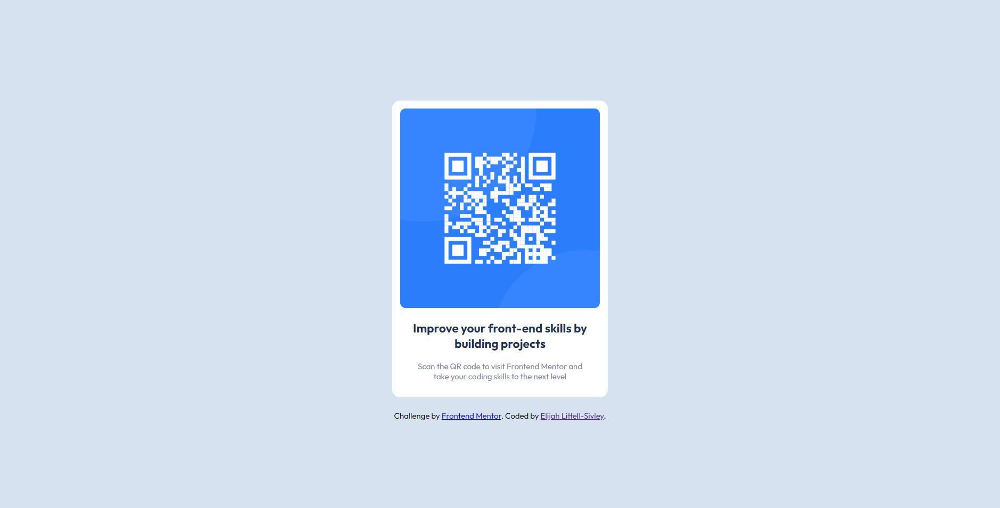

# Frontend Mentor - QR code component solution

This is a solution to the [QR code component challenge on Frontend Mentor](https://www.frontendmentor.io/challenges/qr-code-component-iux_sIO_H). Frontend Mentor challenges help you improve your coding skills by building realistic projects. 

## Table of contents

- [Overview](#overview)
  - [Screenshot](#screenshot)
- [My process](#my-process)
  - [Built with](#built-with)
  - [What I learned](#what-i-learned)
  - [Continued development](#continued-development)
- [Author](#author)

## Overview

Simple design, getting use to the process of submitting!

### Screenshot

## My process

Think of layout, make layout.

### Built with

- HTML
- CSS custom properties
- Flexbox

### What I learned

Just practicing

### Continued development

Working on applying Mobile applications at a faster rate

## Author

- Website - [Elijah Littell-Sivley](https://elijahls.dev)
- Frontend Mentor - [@CyberNotesDev](https://www.frontendmentor.io/profile/CyberNotesDev)
- LinkedIn - [@elijahlittellsivley](https://www.linkedin.com/in/elijahlittellsivley/)
- Github - [@CyberNotesDev](https://github.com/CyberNotesDev)